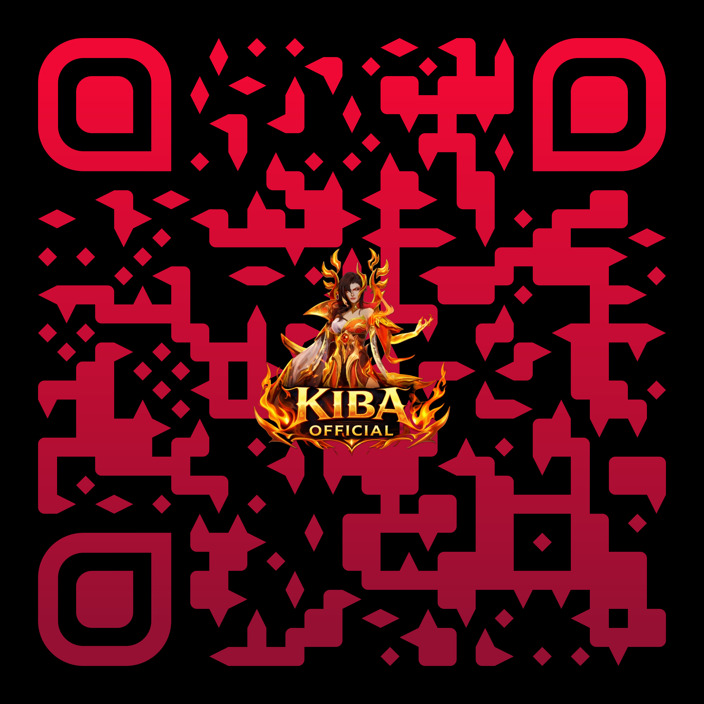

# ShardShop — Plugin by KIBA OFFICIAL

> **Made by KIBA OFFICIAL**

---

## 💬 Join the Discord — Get Updates & Support

### 👉 [discord.gg/E6Wss5BGbG](https://discord.gg/E6Wss5BGbG)

---

**Version:** 1.0.0  
**API target:** Paper 1.21.4  
**Java:** 21

> A professional dual-currency shop for Paper servers featuring a GUI shop,
> auction house, AFK shard rewards, sell wand, coins↔shards conversion,
> and the integrated **Stack Totem** system.

---

## Table of Contents

1. [Installation](#installation)
2. [Currency System](#currency-system)
3. [Commands](#commands)
4. [Permissions](#permissions)
5. [Stack Totem](#stack-totem)
6. [Shop Items of Note](#shop-items-of-note)
7. [Config Reference](#config-reference)
8. [Soft Dependencies](#soft-dependencies)
9. [Support & Donate](#support--donate)

---

## Installation

1. Drop `ShardShop-1.0.0.jar` into your server's `plugins/` folder.
2. Restart the server (do **not** `/reload`).
3. Configure `plugins/ShardShop/config.yml` to your liking.
4. Restart once more to apply config changes.

**Requirements**

| Requirement | Notes |
|---|---|
| Paper 1.21.4+ | Spigot is not supported |
| Java 21 | Must match server JRE |
| Vault (optional) | Economy bridge for Vault-compatible plugins |
| PlaceholderAPI (optional) | Exposes `%shardshop_*%` placeholders |
| WorldGuard (optional) | Shop region protection |

---

## Currency System

ShardShop runs two separate currencies:

| Currency | Symbol | Earned by |
|---|---|---|
| **Coins** | 🪙 | Selling items via `/sell`, auction sales |
| **Shards** | 💎 | AFK timer rewards, admin `/shards give` |

Players can convert Coins → Shards at the configured rate using `/convert`.

---

## Commands

| Command | Description |
|---|---|
| `/shardshop` | Open the GUI shop |
| `/shards <give\|take\|set\|balance> [player] [amount]` | Manage shard balances |
| `/coins <give\|take\|set\|balance> [player] [amount]` | Manage coin balances |
| `/sell <hand\|all\|inventory>` | Sell items for coins |
| `/convert <amount>` | Convert coins to shards |
| `/afk` | Toggle AFK mode to earn shards passively |
| `/ah` | Open the Auction House |
| `/stacktotem give <player> <amount>` | Give a Stack Totem with custom charges |

---

## Permissions

| Permission | Default | Description |
|---|---|---|
| `shardshop.use` | `true` | Open the shop GUI |
| `shardshop.admin` | `op` | Shard/coin admin commands |
| `shardshop.reload` | `op` | Reload the plugin |
| `shardshop.give` | `op` | Give currency to players |
| `shardshop.afk` | `true` | Use `/afk` to earn shards |
| `shardshop.sell` | `true` | Use `/sell` |
| `shardshop.convert` | `true` | Use `/convert` |
| `shardshop.auction` | `true` | Use the Auction House |
| `stacktotem.admin` | `op` | Use `/stacktotem give` |

---

## Stack Totem

The **Stack Totem** is a single physical `TOTEM_OF_UNDYING` item that stores
multiple resurrection charges inside its PDC (Persistent Data Container).

### How it works

- Purchased from the shop as **one item** (not a 64-stack) with **64 charges**.
- On every resurrection, one charge is consumed and the item's lore updates to
  show how many charges remain.
- When the last charge is consumed, the item disappears from the player's
  inventory (identical to a normal totem).
- Dropping the totem is blocked to prevent accidental loss.

### PDC keys stored on the item

| Key | Type | Purpose |
|---|---|---|
| `stackable_totem` | `STRING` | Marks the item as a Stack Totem |
| `stack_totem_charges` | `INTEGER` | Current remaining charges |
| `stack_totem_max` | `INTEGER` | Max charges this totem started with |

> **Fresh shop items** have no `stack_totem_charges` key yet.  
> On first pop the listener reads `stack-totem.default-amount` from
> `config.yml` and initialises both keys automatically.

### Messages on pop

| Type | Content |
|---|---|
| Action bar | `✨ Stack Totem Used! <N> Totems Remaining` |
| Title | `✨ Saved!` / `<N> Totems remaining` |
| Chat | `[Stack Totem] Your Stack Totem saved you!` + charge count |

### Admin command

```
/stacktotem give <player> <amount>
```

- Requires `stacktotem.admin` (default: op).
- Creates a fresh Stack Totem with `<amount>` charges.
- Amount is capped at `stack-totem.max-amount` (default 100 000).

### config.yml options

```yaml
stack-totem:
  default-amount: 64       # charges on shop-bought totems
  max-amount: 100000       # upper cap for /stacktotem give
  actionbar: true          # show action bar message on pop
  title-message: true      # show title on pop
  chat-message: true       # send chat message on pop
  update-lore: true        # auto-update lore with remaining charges
```

---

## Shop Items of Note

### Netherite Pickaxe
Sold pre-enchanted with **Fortune III, Efficiency V, Unbreaking III, Mending**.

### Mace
Sold with **Density V, Breach IV, Wind Burst III, Mending I**.

### Stack Totem *(totem_stack)*
- One physical item, 64 PDC-stored charges.
- Lore auto-updates on every pop.
- Cannot be dropped.

---

## Config Reference

| Section | Purpose |
|---|---|
| `currencies` | Coin/shard display names, symbols, conversion rate |
| `afk` | AFK reward rate (shards/minute), idle threshold |
| `shop` | All shop categories and individual item entries |
| `auction` | Listing fee, duration, max active listings per player |
| `sell-prices` | Per-material coin sell values |
| `stack-totem` | Stack Totem behaviour (see above) |

---

## Soft Dependencies

| Plugin | What it unlocks |
|---|---|
| **Vault** | Economy API bridge |
| **PlaceholderAPI** | `%shardshop_coins%`, `%shardshop_shards%` placeholders |
| **WorldGuard** | Region flags to restrict shop access |

None of these are required — ShardShop loads fully without them.

---

## Support & Donate

If you enjoy the plugin, consider supporting **KIBA OFFICIAL**!

---

### 🔴 Discord — Join & Get Support

**[discord.gg/E6Wss5BGbG](https://discord.gg/E6Wss5BGbG)**



---

### 🔵 USDT (Tron / TRC-20)

**Address:** `UQA2WxzwOQt3B808Z5ezMfwixVdCFdeBG3dtBTm8txHR7QVs`

_1782527819137.png.png)

---

### 🟣 UPI

**UPI ID:** `kebamimi1@oksbi`

_1782527819085.png.png)

---

*Built for Paper 1.21.4 · Java 21 · ShardShop v1.0.0 · Made by KIBA OFFICIAL*
